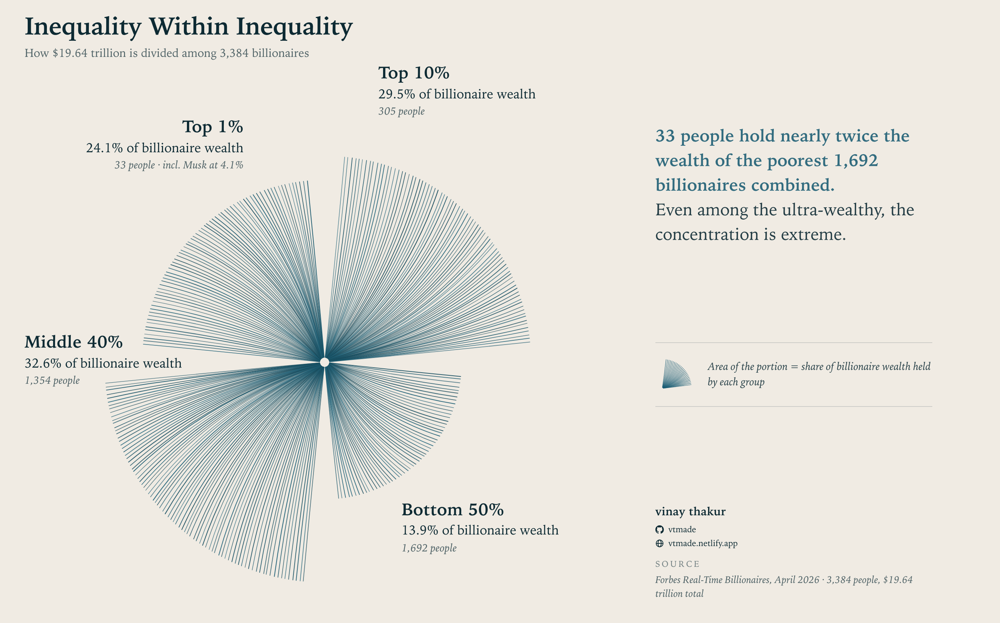

# Vinay Thakur

**Consumer Research · Data Science · Information Design · Art**

**Insights & Analytics Lead @ Visa** | Dubai, UAE

*Where rigorous research and data science marry art.*

 

---

## About

Three worlds converge in my work: **research, data, and art**.

I am a consumer researcher and data scientist who treats data as a narrative medium. Numbers describe; design explains. My work takes empirical research — surveys, behavioral data, millions of search queries, archival text — and turns it into visual stories that reveal patterns numbers alone cannot explain.

With experience across agencies and corporate environments in APAC & CEMEA, currently at Visa Inc, I work on consumer behavior insights, big data patterns, and the craft of making both legible.

| | |
|---|---|
| **Research & Analytics** | Consumer behavior, survey science, qualitative and quantitative methods |
| **Data Science** | Large-scale behavioral datasets, engineered variables, statistical modeling |
| **Information Design** | Charts, perceptual maps, and visual explanations built from data |
| **Art** | Code-based generative art and studio ceramics — the same patterns, by hand |

---

## Data, Designed

One chart from my piece [The $19.64 Trillion Club and What It Actually Looks Like Inside](https://vtmade.netlify.app/billionaire-inequality/) — Forbes billionaire data enriched with World Bank figures and 13 engineered variables, drawn as a proportional spiral where each petal's area is a group's share of wealth:

*Algorithmically drawn — one line per unit of wealth share. Click through for the full interactive article.*

---

## Published Research

**[Wardrobe Dissatisfaction as Identity Expression in Cross-Cultural Synthetic Qualitative Research](https://papers.ssrn.com/sol3/papers.cfm?abstract_id=6699198)**
*SSRN* — A research paper exploring wardrobe dissatisfaction as identity expression, using cross-cultural synthetic qualitative methods — part of my broader work on synthetic respondents and AI-assisted research methodology.

---

## Flagship: The Research Edge

**[theresearchedge.co](https://theresearchedge.co)** — an open, independent platform making rigorous research methodology accessible, practical, and free for social scientists, market researchers, and data professionals. Peer-review-grounded articles, open-source browser tools, datasets, and workflows.

### Conjoint Studio — the big one

A complete **choice-based conjoint (CBC) platform that runs entirely in your browser** — no uploads, your data never leaves your device. [Open the tools page](https://theresearchedge.co/tools/)

- Design balanced experimental study plans with diagnostics
- Estimate part-worth utilities, attribute importance, and willingness-to-pay
- Latent-class market segmentation
- Revenue-focused market simulator for concept testing
- 95% confidence intervals, HTML reports, publication-ready visuals
- Works offline after load, with plain-language guidance at every step

### Tools & Solutions

| Tool | What it does |
|---|---|
| [Correspondence Analysis Map](https://theresearchedge.co/tools/) | Turn numerical grids into perceptual maps, in the browser |
| [GenAI on Quantitative Survey Data](https://theresearchedge.co/tools/) | Claude Code skills + Python workflow for survey analysis |
| [Qualitative Text Analysis](https://theresearchedge.co/tools/) | Structured, method-grounded analysis of transcripts and open-ends |
| [Synthetic Consumers](https://theresearchedge.co/tools/) | A thinking guide on synthetic respondents in market research |

Plus nine (and counting) methodology deep-dives: survey design as instrumentation, synthetic research, AI in qual and quant analysis, sampling theory, measurement science, and causal inference.

---

## Information Design

Information design is where the research and art sides meet — the craft of making data legible.

**[Info Design for GenAI](https://theresearchedge.co/infodesign/)** *(mirror: [infodesign.netlify.app](https://infodesign.netlify.app))* — a curated library of **210 chart & infographic designs**, each with a full specification and a ready-made prompt for generative AI tools. Find a design, copy the spec, add your data — you get the visual, not a pile of code.

|  |  |
|:---:|:---:|
| *Community Blossom — demographics as an organic network* | *Networking Spiral — professional connections as temporal mandala* |

More visual work on the [portfolio's information design gallery](https://vtmade.netlify.app/information-design/).

---

## Code Art: ARDCode

**[ardcode.netlify.app](https://ardcode.netlify.app)** — an interactive digital art gallery of **10 artworks exploring philosophical concepts through code**: particle galaxies, breathing mandalas, sacred geometry, nature's algorithms. Algorithms become the brush; data becomes the canvas. Navigate by scroll, keyboard, or touch — with water-ripple physics and audio-visual integration. ([Source on GitHub](https://github.com/vtmade/Ardcode))

|  |  |
|:---:|:---:|
| *ARDCode — thousands of particles bloom from the center* | *Pi Constellation — 10,001 decimal places of π as colored dots* |

---

## Featured Projects

**[Connect with Gandhi](https://connectwithgandhi.netlify.app)** ([repo](https://github.com/vtmade/connectwithgandhi)) — Interactive exploration of Gandhi's **45,458 collected works** through a radial cluster-tree visualization. Dense archival material turned into an explorable, spatial knowledge interface.

**[Measurement Scales](https://github.com/vtmade/Measurement-Scales)** — Validated measurement scales and research instruments for consumer behavior and social research.

---

## Selected Writing

Data stories from the [portfolio](https://vtmade.netlify.app/writing/) — everyday observations meet behavioral research:

- **[The $19.64 Trillion Club and What It Actually Looks Like Inside](https://vtmade.netlify.app/billionaire-inequality/)** — 3,384 billionaires, $19.64 trillion, and the inequality inside the club of the ultra-wealthy. Interactive, built from Forbes data and 13 engineered variables. *(2026)*
- **[18,528 Country Pairs. Most Have Never Made a Couple.](https://vtmade.netlify.app/writing/country-pairs-couples/)** — What international marriage data reveals about how the world actually mixes. *(2026)*
- **[What Happens When You Analyze Millions of Coffee Searches?](https://vtmade.netlify.app/writing/coffee-searches-3am-questions/)** — The 3 AM questions people whisper into search engines. *(2025)*
- **[Invisible Workers: Why Do Trucks Carry Teddy Bears?](https://vtmade.netlify.app/writing/invisible-workers-teddy-bears/)** — An ethnographic look at a small ritual hiding in plain sight. *(2025)*
- **[A Decade Overnight Success: What 24,653 Devices Reveal About Innovation](https://vtmade.netlify.app/writing/decade-wait-innovation/)** — Budget phones, not flagships, drive innovation adoption. *(2025)*
- **[Mapping Collective Vision of the Future](https://vtmade.netlify.app/writing/mapping-collective-vision-future/)** — Thousands of predictions, clustered into what we collectively expect. *(2025)*
- **[Can Synthetic Data Help Make Sense of Fragmented Market Research?](https://vtmade.netlify.app/writing/synthetic-data-market-research/)** — The case for synthetic respondents, carefully. *(2024)*
- **[Do Facts Change Minds?](https://vtmade.netlify.app/writing/do-facts-change-minds/)** — The psychology of why evidence alone rarely persuades. *(2024)*

---

## Studio

The same instinct for pattern, worked by hand — ceramics from the studio:

|  |  |  |
|:---:|:---:|:---:|

*Hand-built ceramic chess set · sea-floor study in black clay · turquoise vessels — [full gallery](https://vtmade.netlify.app/artwork/)*

---

## GitHub Stats

---

## Current Focus

- Growing **Conjoint Studio** and the open tool suite on [The Research Edge](https://theresearchedge.co/tools/)
- Expanding the [Info Design for GenAI](https://theresearchedge.co/infodesign/) library
- Synthetic data and GenAI applications in market research — including [published work on SSRN](https://papers.ssrn.com/sol3/papers.cfm?abstract_id=6699198)
- Digital payment behavior patterns across APAC & CEMEA
- New code art and ceramics

---

**"Uncovering insights from data by day, shaping clay and code into art by weekend"**

[vtmade.netlify.app](https://vtmade.netlify.app) · [theresearchedge.co](https://theresearchedge.co) · [ardcode.netlify.app](https://ardcode.netlify.app)

